<!-- Header con Wave Effect -->
<div align="center">
  
</div>

<!-- Typing Animation -->
<div align="center">
  
</div>

<br>

<!-- Animated Divider -->


<br>

<!-- About Section con diseño moderno -->
<div align="center">

## 🎯 Sobre Mí

</div>

```javascript
const developer = {
    name: "Alan Meglio",
    location: "Buenos Aires, Argentina 🇦🇷",
    role: "Software Developer",
    education: "Ingeniería en Sistemas de Información @ UTN",
    
    focus: [
        "Desarrollo Web Full Stack",
        "Automatización de Procesos",
        "Soluciones SaaS Escalables",
        "Arquitectura de APIs"
    ],
    
    mindset: {
        approach: "Resolver problemas complejos con código limpio",
        strength: "Persistencia hasta encontrar la solución óptima",
        philosophy: "El código debe ser elegante, eficiente y mantenible"
    },
    
    availability: "Abierto a proyectos freelance",
    contactPreference: "meglioalan@gmail.com"
};
```

<br>

<!-- Tech Stack con animaciones -->
<div align="center">

## 💻 Stack Tecnológico

### Frontend Development


### Backend & Database


### Cloud & DevOps


### Automation & Tools


</div>

<br>

<!-- Animated Divider -->


<br>

<!-- Services Section -->
<div align="center">

## 🚀 ¿Qué Puedo Hacer Por Ti?

</div>

<table align="center">
<tr>
<td width="33%" valign="top" align="center">

### 🌐 Desarrollo Web
Aplicaciones web modernas y responsivas con las últimas tecnologías

**React • TypeScript • Next.js**

Desde landing pages hasta plataformas complejas

</td>
<td width="33%" valign="top" align="center">

### ⚙️ Automatización
Optimización de procesos y flujos de trabajo

**n8n • APIs • Webhooks**

Ahorra tiempo automatizando tareas repetitivas

</td>
<td width="33%" valign="top" align="center">

### ☁️ Soluciones SaaS
Arquitectura escalable en la nube

**Cloud Native • Microservicios**

Aplicaciones robustas que crecen con tu negocio

</td>
</tr>
</table>

<br>

<!-- Animated Divider -->


<br>

<!-- Working Process -->
<div align="center">

## 🔄 Mi Proceso de Trabajo

```mermaid
%%{init: {'theme':'dark'}}%%
graph LR
    A[📋 Análisis] -->|Entender necesidades| B[🎨 Diseño]
    B -->|Planificar solución| C[⚡ Desarrollo]
    C -->|Código limpio| D[🧪 Testing]
    D -->|Asegurar calidad| E[🚀 Deploy]
    E -->|Mantener| F[🔧 Soporte]
    
    style A fill:#3B82F6,stroke:#1E40AF,stroke-width:2px,color:#fff
    style B fill:#8B5CF6,stroke:#6D28D9,stroke-width:2px,color:#fff
    style C fill:#EC4899,stroke:#BE185D,stroke-width:2px,color:#fff
    style D fill:#F59E0B,stroke:#D97706,stroke-width:2px,color:#fff
    style E fill:#10B981,stroke:#059669,stroke-width:2px,color:#fff
    style F fill:#3B82F6,stroke:#1E40AF,stroke-width:2px,color:#fff
```



</div>

<br>

<!-- Why Work With Me -->
<div align="center">

## ⭐ ¿Por Qué Trabajar Conmigo?

</div>

<div align="center">

| 💡 Ventaja | 📝 Detalle |
|-----------|-----------|
| **🎯 Dedicación Total** | Cada proyecto recibe mi máxima atención hasta lograr el resultado óptimo |
| **🔧 Soluciones Personalizadas** | No uso plantillas. Cada línea de código está pensada para tu caso específico |
| **📱 Comunicación Fluida** | Actualizaciones constantes y respuestas rápidas durante todo el proyecto |
| **⚡ Código de Calidad** | Priorizo código limpio, escalable y fácil de mantener |
| **🚀 Entrega Puntual** | Compromiso serio con deadlines y objetivos |

</div>

<br>

<!-- Animated Divider -->


<br>

<!-- Contact Section -->
<div align="center">

## 📬 ¿Tenés Un Proyecto en Mente?

### ¡Hablemos!

<br>

[](mailto:meglioalan@gmail.com)
[](https://www.linkedin.com/in/meglioalan/)

<br>

### 💼 Disponible para Proyectos Freelance

```diff
+ Desarrollo Web Full Stack
+ Automatización de Procesos
+ Soluciones SaaS
+ Integraciones y APIs
+ Consultoría Técnica
```

</div>

<br><br>

<!-- Animated Quote -->
<div align="center">
  
</div>

<br>

<!-- Footer Wave -->
<div align="center">
  
</div>

<div align="center">
  
### ⭐ Si te gustó mi perfil, no dudes en contactarme
  
**Hecho con dedicación por [Alan Meglio](https://github.com/meglioalan)** 💙
  
</div>
