<!-- Cyberpunk Header con Glitch Effect -->
<div align="center">
  
  <!-- Animated Glitch Title -->
  
  
</div>

<!-- Cyber Divider -->


<!-- Rotating Quotes con efecto cyberpunk -->
<div align="center">
  
  ### ⚡ SYSTEM STATUS ⚡
  
  
  
  
  
</div>

<br>

<!-- Terminal Loading Animation -->
<div align="center">
  
```diff
@@@ INITIALIZING PROFILE SYSTEMS @@@

+ [██████████████████████████] 100% LOADING COMPLETE
+ [✓] Neural Networks: ONLINE
+ [✓] Code Compilation: ACTIVE
+ [✓] Creativity Matrix: OPERATIONAL
+ [✓] Problem Solving: MAXIMUM CAPACITY

! WARNING: High levels of dedication detected
! WARNING: Persistence overflow - auto-optimization enabled
```

</div>

<br>

<!-- Cyberpunk Dashboard -->
<div align="center">

## ╔═══════════════════════════════════════╗
## ║  🌐 DEVELOPER DASHBOARD v2.0.26  ║
## ╚═══════════════════════════════════════╝

</div>

```typescript
// ┌─────────────────────────────────────────────────┐
// │  SYSTEM PROFILE: ALAN_MEGLIO.exe               │
// └─────────────────────────────────────────────────┘

interface DeveloperProfile {
    readonly identity: {
        name: "Alan Meglio",
        role: "Software Developer",
        location: "Buenos Aires, AR 🇦🇷",
        status: "AVAILABLE_FOR_FREELANCE_PROJECTS",
        timezone: "GMT-3"
    };
    
    readonly education: {
        degree: "Ingeniería en Sistemas de Información",
        institution: "Universidad Tecnológica Nacional",
        status: "IN_PROGRESS",
        focus: ["Software Architecture", "System Design", "Algorithm Optimization"]
    };
    
    readonly expertise: {
        core: ["Full Stack Development", "Cloud Architecture", "Process Automation"],
        domains: ["Web Applications", "SaaS Platforms", "API Design", "Workflow Automation"],
        approach: "Clean Code | Scalable Solutions | Pixel Perfect"
    };
    
    readonly mindset: {
        philosophy: "Transforming complex problems into elegant solutions",
        superpower: "Relentless persistence until the optimal solution is found",
        codeStyle: "Beautiful, Efficient, Maintainable",
        motto: "Every line of code tells a story"
    };
    
    readonly contact: {
        email: "meglioalan@gmail.com",
        linkedin: "linkedin.com/in/meglioalan",
        availability: "OPEN",
        responseTime: "< 24h"
    };
}

// ► Executing profile_display.sh...
// ► Status: ALL SYSTEMS OPERATIONAL ✓
```

<br>

<!-- Animated Divider with Cyber Effect -->
<p align="center">
  
</p>

<br>

<!-- Tech Stack con efectos 3D -->
<div align="center">

## ⚙️ [ TECHNOLOGY ARSENAL ]

### ► FRONTEND LAYER
<p>
  
</p>

### ► BACKEND CORE  
<p>
  
</p>

### ► DATABASE SYSTEMS
<p>
  
</p>

### ► CLOUD & DEVOPS
<p>
  
</p>

### ► AUTOMATION PROTOCOLS
<p>
  
  
  
</p>

</div>

<br>

<!-- Cyber Divider -->


<br>

<!-- Terminal de Servicios -->
<div align="center">

## 💻 [ AVAILABLE SERVICES ]

```bash
$ ./services --list --mode=premium

┌──────────────────────────────────────────────────────────────┐
│                                                              │
│  [1] FULL STACK WEB DEVELOPMENT                             │
│      → Modern web applications with React & TypeScript      │
│      → Responsive UI/UX with pixel-perfect precision        │
│      → Progressive Web Apps (PWA)                           │
│      → Server-side rendering & optimization                 │
│                                                              │
│  [2] SAAS PLATFORM ARCHITECTURE                             │
│      → Scalable cloud-native applications                   │
│      → Multi-tenant system design                           │
│      → Microservices architecture                           │
│      → Real-time data processing                            │
│                                                              │
│  [3] AUTOMATION & WORKFLOW OPTIMIZATION                     │
│      → Process automation with n8n                          │
│      → Custom workflow integrations                         │
│      → API orchestration & webhooks                         │
│      → Efficiency boost up to 70%                           │
│                                                              │
│  [4] API DESIGN & DEVELOPMENT                               │
│      → RESTful API architecture                             │
│      → GraphQL implementations                              │
│      → Third-party integrations                             │
│      → Documentation & testing                              │
│                                                              │
│  [5] TECHNICAL CONSULTING                                   │
│      → Code review & optimization                           │
│      → Architecture planning                                │
│      → Tech stack selection                                 │
│      → Performance auditing                                 │
│                                                              │
└──────────────────────────────────────────────────────────────┘

$ Status: ✓ All services operational
$ Availability: ✓ Ready for new projects
$ Response time: < 24 hours
```

</div>

<br>

<!-- Cyber Divider -->


<br>

<!-- Development Process con Mermaid Cyberpunk -->
<div align="center">

## 🔄 [ DEVELOPMENT PROTOCOL ]

```mermaid
%%{init: {'theme':'dark', 'themeVariables': { 'primaryColor':'#00f7f7','primaryTextColor':'#fff','primaryBorderColor':'#00f7f7','lineColor':'#00f7f7','secondaryColor':'#1a1a2e','tertiaryColor':'#16213e','fontSize':'16px'}}}%%
graph LR
    A["⚡ ANALYSIS<br/>Requirements<br/>& Planning"] -->|Data Gathering| B["🎨 DESIGN<br/>Architecture<br/>& UI/UX"]
    B -->|Blueprint Ready| C["⚙️ DEVELOPMENT<br/>Clean Code<br/>Implementation"]
    C -->|Build Complete| D["🧪 TESTING<br/>Quality<br/>Assurance"]
    D -->|Validated| E["🚀 DEPLOYMENT<br/>Production<br/>Launch"]
    E -->|Live| F["🔧 MAINTENANCE<br/>Support &<br/>Updates"]
    F -.->|Iterate| A
    
    style A fill:#00f7f7,stroke:#00f7f7,stroke-width:3px,color:#000
    style B fill:#7b2cbf,stroke:#7b2cbf,stroke-width:3px,color:#fff
    style C fill:#ff006e,stroke:#ff006e,stroke-width:3px,color:#fff
    style D fill:#fb5607,stroke:#fb5607,stroke-width:3px,color:#fff
    style E fill:#00f5d4,stroke:#00f5d4,stroke-width:3px,color:#000
    style F fill:#00bbf9,stroke:#00bbf9,stroke-width:3px,color:#fff
```



</div>

<br>

<!-- Cyber Divider -->


<br>

<!-- Why Choose Me - Cyberpunk Style -->
<div align="center">

## ⚡ [ COMPETITIVE ADVANTAGES ]

<table>
<tr>
<td width="50%" valign="top">

### 🎯 DEDICATION PROTOCOL
```python
while project.status != "PERFECT":
    code.optimize()
    design.refine()
    performance.boost()
    client_satisfaction.maximize()
# No compromises until excellence
```

</td>
<td width="50%" valign="top">

### 🚀 DELIVERY SYSTEM
```javascript
const project = {
    timeline: "Strict adherence",
    quality: "Non-negotiable",
    communication: "Real-time",
    updates: "Continuous"
};
return guaranteedSuccess();
```

</td>
</tr>
</table>

<br>

### ► CORE VALUES

| 💎 ATTRIBUTE | 📊 IMPLEMENTATION |
|:---:|:---:|
| **CODE QUALITY** | Clean, Scalable, Documented |
| **PROBLEM SOLVING** | Analytical & Creative |
| **COMMUNICATION** | Clear & Consistent |
| **INNOVATION** | Latest Tech & Best Practices |
| **RELIABILITY** | Deadlines & Commitments |

</div>

<br>

<!-- HACK SIMULATOR - Easter Egg -->
<div align="center">

## 🔐 [ SYSTEM ACCESS LOG ]

```bash
> Initiating secure connection...
> Establishing encrypted tunnel...
> Bypassing firewall... ✓
> Accessing mainframe... ✓
> 
> ██████╗ ██████╗  ██████╗ ███████╗██╗██╗     ███████╗
> ██╔══██╗██╔══██╗██╔═══██╗██╔════╝██║██║     ██╔════╝
> ██████╔╝██████╔╝██║   ██║█████╗  ██║██║     █████╗  
> ██╔═══╝ ██╔══██╗██║   ██║██╔══╝  ██║██║     ██╔══╝  
> ██║     ██║  ██║╚██████╔╝██║     ██║███████╗███████╗
> ╚═╝     ╚═╝  ╚═╝ ╚═════╝ ╚═╝     ╚═╝╚══════╝╚══════╝
>
> ACCESS GRANTED
> User: VISITOR_001
> Clearance Level: PUBLIC
> 
> Available Commands:
>   ./contact.sh    - Initiate collaboration
>   ./portfolio.sh  - View projects
>   ./hire.sh       - Start freelance project
>
> Type './hire.sh' to begin your project...
> _
```

</div>

<br>

<!-- Cyber Divider -->


<br>

<!-- Contact Section Cyberpunk -->
<div align="center">

## 📡 [ ESTABLISH CONNECTION ]

<br>

### ► INITIATE CONTACT PROTOCOL

<p>
  <a href="mailto:meglioalan@gmail.com">
    
  </a>
</p>

<p>
  <a href="https://www.linkedin.com/in/meglioalan/" target="_blank">
    
  </a>
</p>

<br>

```diff
╔══════════════════════════════════════════════════════════╗
║                                                          ║
║  STATUS: 🟢 AVAILABLE FOR FREELANCE PROJECTS            ║
║                                                          ║
║  ACCEPTING:                                              ║
║    ✓ Web Development (Full Stack)                       ║
║    ✓ SaaS Platform Development                          ║
║    ✓ API Design & Integration                           ║
║    ✓ Automation Solutions                               ║
║    ✓ Technical Consulting                               ║
║                                                          ║
║  RESPONSE TIME: < 24 hours                              ║
║  NEXT AVAILABLE: Immediate                              ║
║                                                          ║
╚══════════════════════════════════════════════════════════╝
```

</div>

<br>

<!-- Matrix Effect -->
<div align="center">
  
</div>

<br>

<!-- Rotating Inspirational Quotes -->
<div align="center">

### ⚡ SYSTEM MESSAGES


</div>

<br>

<!-- Footer Terminal -->
<div align="center">

```bash
╔═══════════════════════════════════════════════════════════════╗
║                                                               ║
║   "First, solve the problem. Then, write the code."          ║
║                                        - John Johnson         ║
║                                                               ║
║   "El que persevera, alcanza"                                ║
║                                        - Proverbio            ║
║                                                               ║
╚═══════════════════════════════════════════════════════════════╝

> System Status: ALL SYSTEMS OPERATIONAL ✓
> Profile Version: 2.0.26
> Last Updated: 2026.01.24
> 
> Thank you for visiting my profile
> 
> Made with ⚡ and ☕ by Alan Meglio
> 
> _
```

</div>

<br>

<!-- Animated Footer Wave -->
<div align="center">
  
</div>

---

<div align="center">
  
  ⭐ **If you're seeing this, you've found a developer who doesn't settle for "good enough"** ⭐
  
  <sub>Crafted with precision | Built with passion | Deployed with pride</sub>
  
</div>
