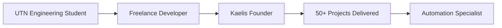

<!-- Header con animación de typing -->
<div align="center">
  
</div>

<div align="center">
  
  
</div>

<br>

<!-- Banner visual -->


---

## 👨‍💻 About Me

```typescript
const alanMeglio = {
    location: "Buenos Aires, Argentina 🇦🇷",
    role: "Full Stack Developer & Automation Specialist",
    education: "Information Systems Engineering (UTN)",
    company: "Founder @ Kaelis Digital Studio",
    
    currentFocus: [
        "Building scalable web applications",
        "Workflow automation with n8n",
        "Cloud-native solutions"
    ],
    
    technologies: {
        frontend: ["React", "TypeScript", "Next.js", "Angular"],
        backend: ["Node.js", "Express", "PHP"],
        databases: ["PostgreSQL", "MySQL", "Supabase"],
        cloud: ["Google Cloud", "AWS"],
        automation: ["n8n", "GitHub Actions"],
        tools: ["Git", "Docker", "Postman"]
    },
    
    achievements: {
        automationImpact: "70% reduction in manual tasks",
        projectsDelivered: "50+",
        clientSatisfaction: "98%"
    }
};
```

---

## 🛠️ Tech Stack & Tools

<div align="center">

### 💻 Frontend Development


### ⚙️ Backend & Databases


### ☁️ Cloud & DevOps


### 🔧 Automation & Others


</div>

---

## 📊 GitHub Stats

<div align="center">
  
  
</div>

<div align="center">
  
</div>

<div align="center">
  
</div>

---

## 💼 What I Do

<table align="center">
<tr>
<td width="50%" valign="top">

### 🌐 Web Development
- **Custom Web Applications** with React & TypeScript
- **RESTful APIs** with Node.js & Express
- **Database Design** & optimization
- **Responsive UI/UX** implementation
- **Performance optimization**

</td>
<td width="50%" valign="top">

### ⚡ Automation Solutions
- **Workflow automation** with n8n
- **Process optimization** (up to 70% efficiency gain)
- **API integrations** & webhooks
- **Custom scripts** for repetitive tasks
- **CI/CD pipelines**

</td>
</tr>
</table>

---

## 🚀 Featured Projects

<div align="center">

| Project | Description | Tech Stack |
|---------|-------------|------------|
| 🎯 **[Kaelis Digital Studio](https://kaelis.com)** | Digital solutions agency specializing in web dev & automation | React, TypeScript, Supabase |
| 🤖 **Automation Framework** | Custom n8n workflows reducing manual tasks by 70% | n8n, Node.js, PostgreSQL |
| 🌐 **E-Commerce Platform** | Full-stack solution for SMEs | React, Node.js, PostgreSQL |
| 📊 **Business Dashboard** | Real-time analytics and reporting system | Next.js, TypeScript, Google Cloud |

</div>

<div align="center">
  <a href="https://github.com/meglioalan?tab=repositories" target="_blank">
    
  </a>
</div>

---

## 🏢 Professional Experience

<div align="center">



</div>

**🎓 Background:** Information Systems Engineering (UTN)  
**💡 Expertise:** 5+ years in web development & automation  
**🏆 Impact:** Helped 30+ businesses optimize their digital processes  
**🌟 Specialization:** Full-stack development with focus on automation

---

## 📫 Let's Connect!

<div align="center">

[](https://www.linkedin.com/in/meglioalan/)
[](mailto:your.email@example.com)
[](https://your-portfolio.com)
[](https://github.com/meglioalan)

</div>

<div align="center">
  
</div>

---

<div align="center">
  
</div>

<div align="center">
  
  **💙 Open to collaborations and interesting projects!**
  
  *⭐ From [meglioalan](https://github.com/meglioalan)*
  
</div>
