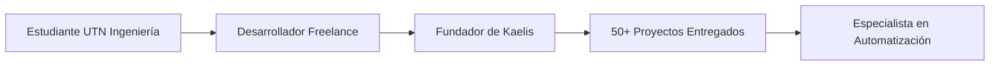

<!-- Header con animación de typing -->
<div align="center">
  
</div>

<div align="center">
  
  
</div>

<br>

<!-- Banner visual -->


---

## 👨‍💻 Sobre Mí

```typescript
const alanMeglio = {
    ubicacion: "Buenos Aires, Argentina 🇦🇷",
    rol: "Desarrollador Full Stack & Especialista en Automatización",
    educacion: "Ingeniería en Sistemas de Información (UTN)",
    empresa: "Fundador @ Kaelis Digital Studio",
    
    enfoqueActual: [
        "Desarrollo de aplicaciones web escalables",
        "Automatización de flujos de trabajo con n8n",
        "Soluciones cloud-native"
    ],
    
    tecnologias: {
        frontend: ["React", "TypeScript", "Next.js", "Angular"],
        backend: ["Node.js", "Express", "PHP"],
        baseDeDatos: ["PostgreSQL", "MySQL", "Supabase"],
        cloud: ["Google Cloud", "AWS"],
        automatizacion: ["n8n", "GitHub Actions"],
        herramientas: ["Git", "Docker", "Postman"]
    },
    
    logros: {
        impactoAutomatizacion: "70% de reducción en tareas manuales",
        proyectosEntregados: "50+",
        satisfaccionClientes: "98%"
    }
};
```

---

## 🛠️ Stack Tecnológico y Herramientas

<div align="center">

### 💻 Desarrollo Frontend


### ⚙️ Backend y Bases de Datos


### ☁️ Cloud y DevOps


### 🔧 Automatización y Otros


</div>

---

## 📊 Estadísticas de GitHub

<div align="center">
  
  
</div>

<div align="center">
  
</div>

<div align="center">
  
</div>

---

## 💼 Lo Que Hago

<table align="center">
<tr>
<td width="50%" valign="top">

### 🌐 Desarrollo Web
- **Aplicaciones web personalizadas** con React & TypeScript
- **APIs RESTful** con Node.js & Express
- **Diseño de bases de datos** y optimización
- **UI/UX responsive** implementación
- **Optimización de rendimiento**

</td>
<td width="50%" valign="top">

### ⚡ Soluciones de Automatización
- **Automatización de flujos** con n8n
- **Optimización de procesos** (hasta 70% de eficiencia)
- **Integraciones de APIs** y webhooks
- **Scripts personalizados** para tareas repetitivas
- **Pipelines CI/CD**

</td>
</tr>
</table>

---

## 🚀 Proyectos Destacados

<div align="center">

| Proyecto | Descripción | Stack Tecnológico |
|---------|-------------|-------------------|
| 🎯 **[Kaelis Digital Studio](https://kaelis.com)** | Agencia de soluciones digitales especializada en desarrollo web y automatización | React, TypeScript, Supabase |
| 🤖 **Framework de Automatización** | Flujos de trabajo personalizados en n8n que reducen tareas manuales en 70% | n8n, Node.js, PostgreSQL |
| 🌐 **Plataforma E-Commerce** | Solución full-stack para PyMEs | React, Node.js, PostgreSQL |
| 📊 **Dashboard Empresarial** | Sistema de análisis y reportes en tiempo real | Next.js, TypeScript, Google Cloud |

</div>

<div align="center">
  <a href="https://github.com/meglioalan?tab=repositories" target="_blank">
    
  </a>
</div>

---

## 🏢 Experiencia Profesional

<div align="center">



</div>

**🎓 Formación:** Ingeniería en Sistemas de Información (UTN)  
**💡 Experiencia:** +5 años en desarrollo web y automatización  
**🏆 Impacto:** Ayudé a más de 30 empresas a optimizar sus procesos digitales  
**🌟 Especialización:** Desarrollo full-stack con enfoque en automatización

---

## 📫 ¡Conectemos!

<div align="center">

[](https://www.linkedin.com/in/meglioalan/)
[](mailto:tu.email@ejemplo.com)
[](https://tu-portfolio.com)
[](https://github.com/meglioalan)

</div>

<div align="center">
  
</div>

---

<div align="center">
  
</div>

<div align="center">
  
  **💙 ¡Abierto a colaboraciones y proyectos interesantes!**
  
  *⭐ De [meglioalan](https://github.com/meglioalan)*
  
</div>
